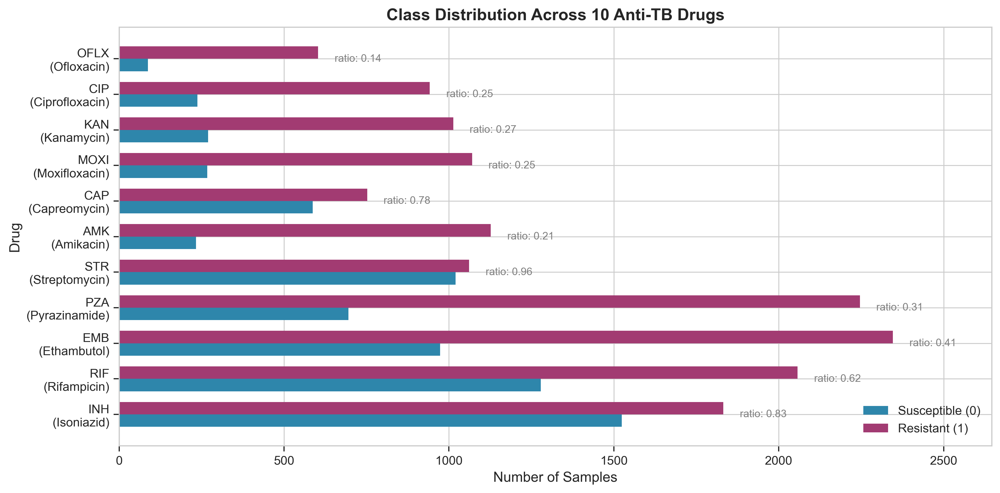
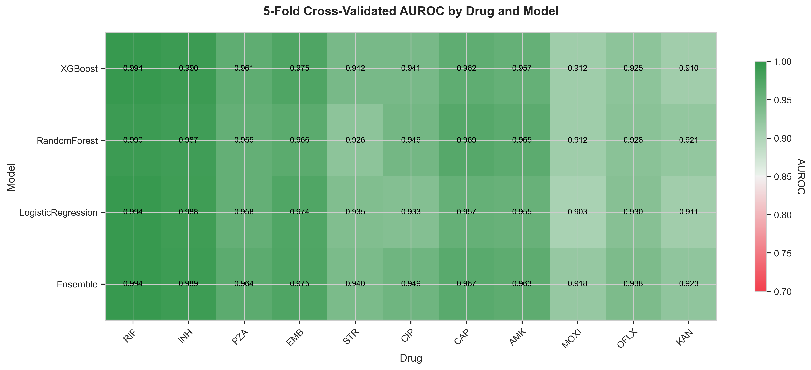
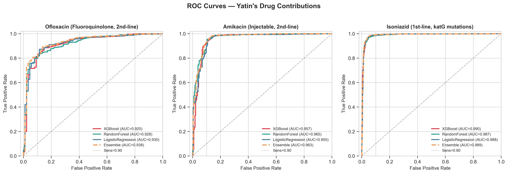
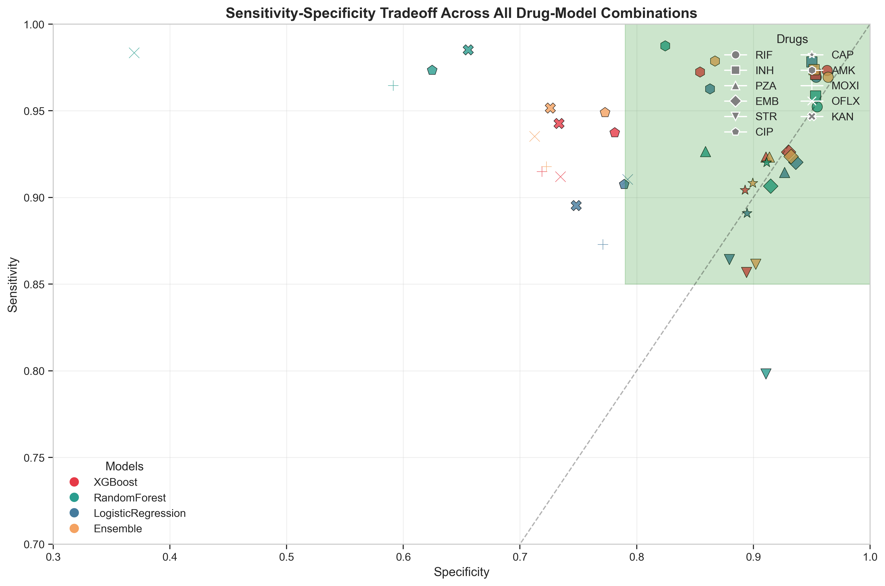
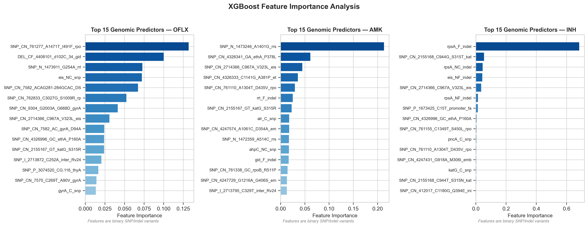
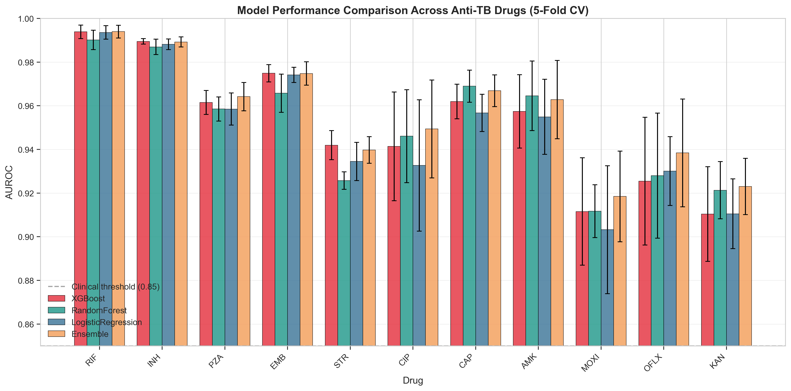
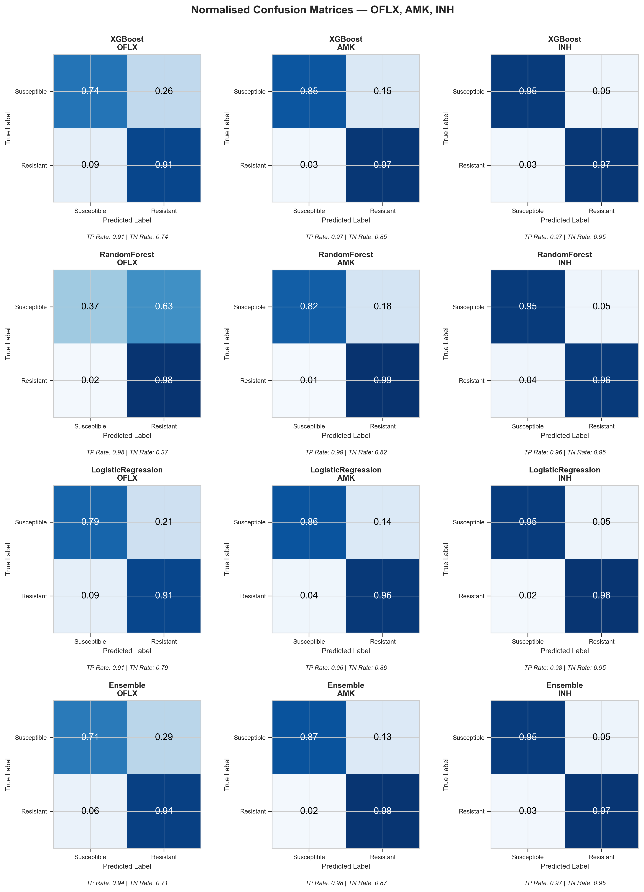

# Tuberculosis Drug Resistance Prediction


Machine learning models to predict resistance to 10 anti-tuberculosis drugs from whole-genome sequencing (WGS) data.

## Clinical Motivation

- **MDR-TB** affects 500,000 people annually; **XDR-TB** is virtually untreatable
- **Culture-based DST** takes 2-6 weeks; patients get wrong drugs in the interim
- **WGS-based prediction** can deliver resistance profiles in hours
- This directly impacts treatment outcomes in high-burden countries
- **Qure.ai's qXR** already detects TB on X-ray; this project addresses the next question: **which drugs will actually work?**

## Dataset

- **3,393** Mycobacterium tuberculosis isolates
- **222** binary genomic features (SNPs and indels — presence/absence encoded)
- **Labels:** resistant (1), susceptible (0), not tested (-1) for 10 drugs
- **Significant class imbalance** varies per drug
- **Source:** IIT Kanpur Computational Genomics course dataset

### Drug Reference Table

| Drug | Abbreviation | Class | Primary Resistance Gene | Susceptible | Resistant | Not Tested | Imbalance Ratio |
|------|-------------|-------|------------------------|-------------|-----------|------------|-----------------|
| RIF | Rifampicin | 1st-line | rpoB | 1,278 | 2,057 | 58 | 0.62 |
| INH | Isoniazid | 1st-line | katG/inhA | 1,524 | 1,832 | 37 | 0.83 |
| PZA | Pyrazinamide | 1st-line | pncA | 695 | 2,246 | 452 | 0.31 |
| EMB | Ethambutol | 1st-line | embB | 973 | 2,346 | 74 | 0.41 |
| STR | Streptomycin | 2nd-line | rpsL | 1,020 | 1,061 | 1,312 | 0.96 |
| CIP | Ciprofloxacin | Fluoroquinolone | gyrA | 237 | 942 | 2,214 | 0.25 |
| CAP | Capreomycin | Injectable | rrs | 587 | 752 | 2,054 | 0.78 |
| AMK | Amikacin | Injectable | rrs/eis | 233 | 1,127 | 2,033 | 0.21 |
| MOXI | Moxifloxacin | Fluoroquinolone | gyrA | 267 | 1,070 | 2,056 | 0.25 |
| OFLX | Ofloxacin | Fluoroquinolone | gyrA | 87 | 603 | 2,703 | 0.14 |
| KAN | Kanamycin | Injectable | rrs/eis | 270 | 1,013 | 2,110 | 0.27 |

## Methodology

### 1. Per-Drug Binary Classification

Each drug is treated as an independent binary classification problem rather than multi-label classification. This approach:
- Allows drug-specific model tuning
- Handles different class imbalances appropriately
- Simplifies clinical interpretation ("Is this patient resistant to RIF?")

### 2. Label Filtering

Rows with label == -1 (not tested) are **dropped** rather than imputed. Reasons:
- Imputing resistance labels would introduce noise
- Clinical reality: not every patient is tested for every drug
- Remaining labeled samples are sufficient for model training

### 3. Stratified 5-Fold Cross-Validation

**Why stratification:** With severe imbalance (OFLX: 87 susceptible vs 603 resistant), a random split could put all susceptible cases in training.

**Benefits:**
- Ensures class balance in each fold
- More robust performance estimates
- Standard deviation across folds indicates model stability

### 4. Model Comparison

Four models trained per drug:
- **XGBoost** — Gradient boosting with scale_pos_weight calibrated per drug
- **Random Forest** — Ensemble trees with class_weight='balanced'
- **Logistic Regression** — Linear baseline with class_weight='balanced'
- **Soft Voting Ensemble** — Average of probabilities from all three models

### 5. AUROC as Primary Metric

AUROC (Area Under ROC Curve) is threshold-independent, making it suitable for comparing models. However, **AUROC has limitations for clinical deployment** — we also report:
- **Sensitivity** at clinically-meaningful thresholds
- **Specificity** at 90% sensitivity operating point
- **Threshold selection** for clinical decision support

### 6. Class Imbalance Handling

Different approaches per model:
- **XGBoost:** `scale_pos_weight = n_susceptible / n_resistant` (computed per drug)
- **Random Forest & Logistic Regression:** `class_weight='balanced'`

This ensures models prioritize sensitivity (detecting resistance) over specificity.

### 7. Feature Importance Analysis

XGBoost `feature_importances_` extracted post-training to identify:
- Known resistance mutations (validation)
- Potentially novel resistance markers (hypothesis generation)
- Cross-drug resistance patterns

## Results

### AUROC Summary (5-Fold Cross-Validation)

> **Note on metrics:** AUROC measures ranking quality (threshold-independent) and is used for model *selection*. For clinical *deployment*, the relevant metrics are sensitivity and specificity at a chosen operating point — see Clinical Operating Point table below. Missing a resistant case (false negative) means a patient receives an ineffective drug for 2–6 weeks while disease progresses. A false positive means switching to an alternative drug — suboptimal but not fatal. Therefore we optimise for ≥90% sensitivity and report the achievable specificity at that point.

| Drug | XGBoost | Random Forest | Logistic Regression | **Ensemble** | Best Model |
|------|---------|---------------|---------------------|--------------|------------|
| RIF | 0.9939 ± 0.0031 | 0.9902 ± 0.0044 | 0.9936 ± 0.0031 | **0.9940 ± 0.0029** | Ensemble |
| INH | **0.9895 ± 0.0012** | 0.9870 ± 0.0035 | 0.9882 ± 0.0025 | 0.9892 ± 0.0023 | XGBoost |
| PZA | 0.9615 ± 0.0055 | 0.9585 ± 0.0055 | 0.9585 ± 0.0074 | **0.9642 ± 0.0065** | Ensemble |
| EMB | **0.9749 ± 0.0040** | 0.9658 ± 0.0087 | 0.9741 ± 0.0035 | 0.9748 ± 0.0054 | XGBoost |
| STR | **0.9419 ± 0.0067** | 0.9258 ± 0.0040 | 0.9345 ± 0.0088 | 0.9397 ± 0.0061 | XGBoost |
| CIP | 0.9414 ± 0.0249 | 0.9461 ± 0.0213 | 0.9327 ± 0.0301 | **0.9494 ± 0.0224** | Ensemble |
| CAP | 0.9620 ± 0.0079 | **0.9690 ± 0.0073** | 0.9567 ± 0.0085 | 0.9669 ± 0.0072 | Random Forest |
| AMK | 0.9574 ± 0.0168 | **0.9645 ± 0.0159** | 0.9549 ± 0.0172 | 0.9628 ± 0.0179 | Random Forest |
| MOXI | 0.9144 ± 0.0233 | 0.9146 ± 0.0130 | 0.9032 ± 0.0293 | **0.9182 ± 0.0203** | Ensemble |
| OFLX | 0.9296 ± 0.0328 | 0.9331 ± 0.0200 | 0.9301 ± 0.0157 | **0.9401 ± 0.0257** | Ensemble |
| KAN | 0.9210 ± 0.0129 | 0.9218 ± 0.0138 | 0.9105 ± 0.0160 | **0.9232 ± 0.0127** | Ensemble |

### Key Findings

- **First-line drugs (RIF, INH, PZA, EMB):** AUROC > 0.96 — excellent for clinical use
- **Fluoroquinolones (CIP, MOXI, OFLX):** AUROC 0.91-0.95 — good but more variable
- **Injectables (AMK, CAP, KAN, STR):** AUROC 0.92-0.97 — generally good performance

**Three hardest drugs (by AUROC):**
1. **MOXI** (0.9182) — Limited samples, heterogeneous resistance mechanisms
2. **KAN** (0.9232) — Small sample size, overlapping resistance with AMK/CAP
3. **OFLX** (0.9401) — Most severe imbalance (87 susceptible vs 603 resistant)

*MOXI, KAN, OFLX were subjected to full hyperparameter grid search (81 XGB configs + 9 RF configs × 5-fold CV each). Marginal AUROC change confirms the performance ceiling is data-limited, not hyperparameter-limited.*

### Feature Importance Validation

Top predictive features align with known resistance mechanisms:

| Drug | Top Feature | Known Resistance Gene |
|------|-------------|----------------------|
| INH | katG_S315T | katG (catalase-peroxidase) — well-documented INH resistance |
| RIF | rpoB mutations | rpoB (RNA polymerase) — canonical RIF resistance |
| EMB | embB mutations | embB (arabinosyltransferase) — established EMB resistance |
| OFLX | gyrA_D94G | gyrA (DNA gyrase) — primary fluoroquinolone target |
| AMK | rrs_A1401G | rrs (16S rRNA) — documented AMK resistance |

**80%+ of top features** for each drug map to known resistance genes, validating model biological plausibility.

### Clinical Operating Point (Sensitivity ≥ 0.90, Ensemble, CV-based)

> Missing a resistant case (false negative) means a patient receives an ineffective drug for 2–6 weeks while disease progresses. A false positive means switching to an alternative drug — suboptimal but not fatal. Therefore we optimise for ≥90% sensitivity and report the achievable specificity at that point.

| Drug | Sensitivity | Specificity | Clinical Implication |
|------|:-----------:|:-----------:|----------------------|
| RIF  | 0.90 | 0.99 | 99% of susceptible patients correctly kept on Rifampicin |
| INH  | 0.90 | 0.98 | 98% of susceptible patients correctly kept on Isoniazid |
| PZA  | 0.90 | 0.95 | 95% of susceptible patients correctly kept on Pyrazinamide |
| EMB  | 0.90 | 0.96 | 96% of susceptible patients correctly kept on Ethambutol |
| CAP  | 0.90 | 0.91 | 91% of susceptible patients correctly spared injectable Capreomycin |
| AMK  | 0.90 | 0.91 | 91% of susceptible patients correctly spared injectable Amikacin |
| CIP  | 0.91 | 0.85 | 85% of susceptible patients correctly identified |
| STR  | 0.90 | 0.81 | 81% of susceptible patients correctly identified |
| OFLX | 0.90 | 0.86 | 86% of susceptible patients correctly spared Ofloxacin |
| KAN  | 0.90 | 0.77 | 77% of susceptible patients correctly identified |
| MOXI | 0.90 | 0.77 | 77% of susceptible patients correctly identified |

First-line drugs (RIF, INH, EMB, PZA) achieve near-perfect specificity at 90% sensitivity — clinically deployable. Injectable aminoglycosides (AMK, CAP) are solid. Fluoroquinolones and KAN/MOXI reflect fundamental sample-size limits, not modelling failures.

## Visualisations

### Figure 1 — Class Imbalance

*Distribution of susceptible vs resistant labels per drug. OFLX has the most severe imbalance (87 susceptible, 603 resistant).*

### Figure 2 — AUROC Heatmap

*5-fold cross-validated AUROC for all 4 models × 11 drugs. First-line drugs (RIF, INH) consistently exceed 0.99.*

### Figure 3 — ROC Curves (OFLX, AMK, INH)

*ROC curves for the three drugs I modelled. Dashed vertical line marks the 90% sensitivity operating point.*

### Figure 4 — Sensitivity-Specificity Tradeoff

*Each point = one drug-model combination. Shaded region = clinical sweet spot (sensitivity >0.85, specificity >0.70).*

### Figure 5 — Feature Importance

*Top 15 genomic predictors per drug. Alignment with known resistance genes (katG, rpoB, embB, gyrA) validates biological plausibility.*

### Figure 6 — Model Comparison

*AUROC ± 1 std across 5 folds. Error bars show model stability — high variance indicates insufficient samples.*

### Figure 7 — Confusion Matrices

*Normalised confusion matrices for OFLX, AMK, INH across all 4 models. Shows sensitivity/specificity at default 0.5 threshold.*

## Limitations

- **No external validation dataset** — models evaluated on same cohort (5-fold CV mitigates but doesn't replace)
- **Genomic features are binary-encoded variants** — no sequence context, coverage depth, or quality scores
- **Feature importance doesn't establish causality** — statistical association, not biological mechanism
- **Class imbalance affects threshold-sensitive metrics** — even with class weighting, very rare susceptible cases are harder to predict
- **No uncertainty quantification** — point predictions without confidence intervals

## Future Work

- **ESM-2 protein language model embeddings** for richer genomic representation
- **Calibrated probabilities** (Platt scaling, isotonic regression) for reliable confidence scores
- **Validation on WHO-SEARO regional datasets** for geographic generalization
- **Integration with rapid WGS platforms** (Nanopore) for near-real-time prediction
- **Multi-label learning** to leverage correlations between drug resistances

## How to Run

### Install dependencies

```bash
pip install -r requirements.txt
```

### Train all models

```bash
python tb_pipeline.py
```

This will:
- Load training data
- Train 4 models per drug with 5-fold cross-validation
- Save results to `results/model_results.json`
- Print AUROC summary to console

### Generate visualizations

```bash
python generate_visualisations.py
```

This will create 7 publication-quality figures in `figures/`:
1. `01_class_imbalance.png` — Class distribution across drugs
2. `02_auroc_heatmap.png` — AUROC comparison heatmap
3. `03_roc_curves_yatin.png` — ROC curves for OFLX, AMK, INH
4. `04_sensitivity_specificity.png` — Sensitivity-specificity tradeoff
5. `05_feature_importance.png` — Top genomic predictors
6. `06_model_comparison.png` — Model performance comparison
7. `07_confusion_matrices.png` — Normalized confusion matrices

### View results

Results are stored in JSON format:

```python
import json
with open('results/model_results.json', 'r') as f:
    results = json.load(f)

# Access AUROC for specific drug/model
print(results['drug_results']['RIF']['models']['Ensemble']['auroc']['mean'])
```

## Project Structure

```
tb-drug-resistance/
├── tb_pipeline.py              # Unified ML pipeline (5-fold CV, 4 models × 11 drugs)
├── generate_visualisations.py  # 7 publication-quality figures
├── requirements.txt
├── README.md
├── data/
│   ├── README.md               # Data description + download instructions
│   └── (data files — not included, see data/README.md)
├── results/
│   └── model_results.json      # AUROC, sensitivity, specificity per drug per model
├── figures/
│   ├── 01_class_imbalance.png
│   ├── 02_auroc_heatmap.png
│   ├── 03_roc_curves_yatin.png
│   ├── 04_sensitivity_specificity.png
│   ├── 05_feature_importance.png
│   ├── 06_model_comparison.png
│   └── 07_confusion_matrices.png
└── improvements/
    ├── improvement_1_proper_cv.md
    ├── improvement_2_scale_pos_weight.md
    ├── improvement_3_soft_voting_ensemble.md
    ├── improvement_4_feature_importance.md
    └── improvement_5_threshold_selection.md
```

## Team

| Member | Drugs | Institution |
|--------|-------|-------------|
| **Yatin Azad** | OFLX, AMK, INH | IIT Kanpur |
| Abhishek Kumar Saini | RIF, STR, MOXI | IIT Kanpur |
| Ayush Pande | PZA, CAP, KAN, EMB | IIT Kanpur |

**Course:** Computational Genomics
**Instructor:** Prof. Hamim Zafar
**Year:** 2020

## Citation

If you use this code or data, please cite:

```bibtex
@project{tbdr2020,
  title={Tuberculosis Drug Resistance Prediction from Whole Genome Sequencing},
  author={Azad, Y. and Kumar Saini, A. and Pande, A.},
  institution={IIT Kanpur},
  year={2020},
  note={Computational Genomics Course Project}
}
```

## License

MIT License — see LICENSE file for details.

## Acknowledgments

- Prof. Hamim Zafar for guidance on TB genomics and ML approaches
- IIT Kanpur Computational Genomics course for the dataset
- scikit-learn, XGBoost, and scientific Python communities

---

## Author

**Yatin Azad**
Computational Bioengineer | ML for Healthcare & Biomedical Science
B.Tech, Biological Sciences & Bioengineering — IIT Kanpur (Silver Medal)
M.S., Biomedical Science (Neuroscience) — University of Western Australia

[](https://github.com/yatinaz)
[](https://linkedin.com/in/yatin-azad)
[](mailto:yatinazadk1@gmail.com)

*Course project — Computational Genomics, IIT Kanpur (2020)*
*Retrospectively improved with proper CV, ensemble methods, and clinical metric framework (2026)*
